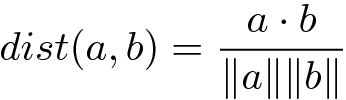

## Recursion Practice
We're going to be implementing an algorithm that relies on recursion. We're going to practice with some problems. Write the functions in `recursion_practice.py`.

We'll be using this implementation of a `TreeNode` (in `node.py`) for all the questions concerning trees (2-4):

```python
class TreeNode:
    def __init__(self, value, left=None, right=None):
        self.value = value
        self.left = left
        self.right = right
```

1. Write a recursive function which takes an integer and computes and sum of the digits:

    ```python
    sum_digits(4502)    # returns 11
    ```

    Here's how to think about it recursively:
    ```
    4502 % 10 gives you 2
    4502 / 10 gives you 450
    So sum_digits(4502) = 4502 % 10 + sum_digits(4502 / 10)
    ```

2. Write a function `sum_tree` which sums all the values in a binary tree. Here's how to think about it recursively:

    ```
    sum_tree(root) = sum_tree(root.left) + sum_tree(root.right) + root.value
    ```

3. Write a function `print_all` which prints all the values in a binary tree. In your recursive call you'll need to print `root.left`, `root.right` and `root.value`. You can do these three things in any order and it will affect the order of the outcome.

    As a sidenote these are called *traversals* and each possible order has a name. **Preorder** is `value, left, right`. **Postorder** is `left, right, value`. **Inorder** is `left, value, right`.

4. Write a function `build_coinflip_tree` which takes an integer *k* and builds the tree containing all the possible results of flipping a coin *k* times. The value at each node should be a string of the flips to get there. For example, if *k* is 3, your tree should look like something similar to this:

    ```
                       ''
                     /    \
                   /        \
                 /            \
               /                \
             H                    T
           /   \                /   \
         /       \            /       \
       HH         HT        TH         TT
      /  \       /  \      /  \       /  \
    HHH  HHT   HTH  HTT  THH  THT   TTH  TTT
    ```

    To verify your result, you'll have to just do things like:
    ```python
    root = build_coinflip_tree(3)
    assert root.value == ""
    assert root.left.value == "H"
    assert root.left.left.value == "HH"
    ```
    or build the tree manually and use the `equals` function written in `recusion_examples.py`.
    
    **Hint:** The `value` parameter you'll see in the docstring is so that you can pass to the tree what path you took to get there. It might make the problem a little easier to build a tree like this instead:
    
    ```
         ''
        /  \
       /    \
      H      T
     / \    / \
    H   T  H   T
    ```


## k Nearest Neighbors
This algorithm is very simple to implement. Note that it takes nothing to train the model, you just need to save the data. When given a new data point, you need to calculate the distance of that data point to every existing data point and find the *k* closest ones.


### Data

You can also use sklearn's `make_classification` for creating a fake dataset like we did in a previous exercise.

```python
X, y = make_classification(n_features=4, n_redundant=0, n_informative=1,
                           n_clusters_per_class=1, class_sep=5, random_state=5)
```

## kNN Implementation

Include all code for this section in the file `KNearestNeighbors.py`
Here's the pseudocode for `k` Nearest Neighbors:

    kNN:
        for every point in the dataset:
            calculate the distance between the point and x
            sort the distances in increasing order
            take the k items with the smallest distances to x
            return the majority class among these items

1. Implement the function `euclidean_distance` which computes the Euclidean distance between two numpy arrays. Euclidean distance only works for continuous features.

2. Implement the class `KNearestNeighbors`. We are going to write our code similar to how sklearn does. So you should be able to run your code like this:

    ```python
    knn = KNearestNeighbors(k=3, distance=euclidean_distance)
    knn.fit(X, y)
    y_predict = knn.predict(X)
    ```

    Here `X` is the feature matrix as a 2d numpy array, `y` is the labels as a numpy array. 3 is the *k* and `euclidean_distance` is the distance function. `predict` will return a numpy array of the predicted labels.

    You will need to implement a `KNearestNeighbors` class with three methods: `fit`, `predict` and `score` (calculates accuracy).

3. Implement `cosine_distance` which computes the cosine distance function. This gives the angle between the two vectors. Here is the formula:

    

4. Plot the decision boundary. Look at this [sklearn example](http://scikit-learn.org/stable/auto_examples/neighbors/plot_classification.html#example-neighbors-plot-classification-py). Note that you'll need exactly 2 continuous features in order to do this.

5. Test your algorithm on a dataset used for a previous exercise. Use [sklearn.metrics](http://scikit-learn.org/stable/modules/classes.html#module-sklearn.metrics) to compute the accuracy, precision and recall of your model. Use KFold Cross Validation and determine the best choice of `k` (will probably depend on which metric you use!).


## Extra Credit (Harder Recursion Problems)
1. Go back to the traversal problem from above. If you are given the *output* of that function, can you rebuild the tree? Let's say you have the preorder and inorder. Write a function which builds the tree. You can assume values are unique.

    **Hint:** The first item in the preorder traversal is the root. In the inorder traversal, everything to the left of the root is in the left subtree and everything to the right is in the right subtree.

2. Write a function `print_tree` which takes a tree and prints the output in a human readable format.

3. Write a function `make_word_breaks` which takes a string `phrase` and a set `word_list`. The idea is to determine if you can make word breaks in the string. For example: `"thedogruns"` would become `"the dog runs"`. Of course for many strings of letters, this is not possible. Don't worry about being efficient, just try every possibility.
