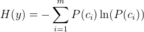

## Decision Trees

Decision trees are a recursive divide and conquer algorithm. They are a non-linear, non-parametric discriminative supervised classification algorithm.  There are a few names of decision tree algorithms you may have heard of (ID3, C4.5, CART, etc.) and each is a different specification of a decision tree model.  You can read about them [here](http://stackoverflow.com/questions/9979461/different-decision-tree-algorithms-with-comparison-of-complexity-or-performance) and [here](http://scikit-learn.org/stable/modules/tree.html#tree-algorithms-id3-c4-5-c5-0-and-cart).

### Play Golf Dataset

When implementing any ML algorithm for the first time, it is often easier to start with a trivially simple data set. You should always focus on one portion of the pipeline at a time: we do not want worry about cleaning data during feature selection just as we do not want to worry about feature engineering when writing our model building code.  We will be using the canonical 'Play Golf' [dataset](http://www2.cs.uregina.ca/~dbd/cs831/notes/ml/dtrees/c4.5/c4.5_prob1.html) when writing our algorithm.

Look at the [golf data](data/playgolf.csv). You will also see a dataset with just the categorial features and one with just the continuous features. Starting with just categorical features may be easier for implementation.

### Pseudo-code

Here's the pseudocode for the algorithm you will be implementing.

    function buildTree:
        If every item in the dataset is in the same class: 
            return the class label
        Else:
            find the best feature and value to split the data 
            split the dataset
            create a node
            for each split
                call buildTree and add the result to the node
            return node

### Implementation

You've been given starter code in the [code](code) folder. Some of the instance variables chosen are not the only possible way of implementing a decision tree, so feel free to modify anything if it fits your implementation better.

* The `TreeNode` class is implemented. These are the instance variables:

    * `column` (int): index of feature to split on
    * `children` (dict): dictionary representing child nodes.  Should have the value of the feature as a key and the child node as the value.  
    * `leaf` (boolean): true or false depending on if the node is a leaf node.    
    * `classes` (dictionary): if a leaf, a count of all the list of all the classes of the data points that terminate at this leaf.  Can be used to assess how "accurate" an individual leaf is.

    The `as_string` function is designed to help you be able to print out decision tree (mostly for debugging).

* There is minimal starter code for the `DecisionTree` class. You will need to fill in the class so that you can use your decision tree code as follows, assuming `data` has been initalized to 2 dimensional numpy array containing the play golf dataset. In this example, `data` has 5 columns and 19 rows. The last row (index 4) is the result we are trying to classify.

        tree = DecisionTree(X, ['Outlook', 'Temperature', 'Humidity', 'Windy', 'Result'], 4)
        print tree.classify(['sunny', 80, 90, true])

    You can see that the `__str__` method is implemented for you. This enables you to print your tree for debugging purposes:

        print tree

### Steps to Implementing

We will be implementing the **CART** algorithm. This means that every split will be binary. For categorical features, splits will be like: sunny or not sunny. For continuous features, splits will be like: >80 or <=80.

Feel free to start by restricting yourself to categorical features to make things a little simpler.

1. Implement an `entropy` function, which is given by the following equation. Entropy measures the amount of "disorder" in a set. Here there are *m* elements in the set and *ci* is the class of the *i*-th element.

    

    *P(c)* = (count of occurrences of class *c*) / *m*

2. To write the `build_tree` method which recursively builds the tree, you will probably want the following methods:
    * `information_gain`: Given a binary split of the dataset, returns the information gain based on this formula:

        

        *D* is the set of sets which make up *S* based on our split. In our case, since we're only doing binary splits, the information gain is as follows.
        
    * `choose_split`: Determine the best feature and value to split the dataset on.
    * `make_split`: Given feature and value, return the two subsets that are created from splitting on that feature and value (note that this works differently depending if the feature is continuous or categorical).
3. Implement a `classify` method for the `DecisionTree` class which takes a new data point and predicts its class based on the decision tree. It may be helpful to have a recursive `classify` method in the `TreeNode` class as well.

### Decision Trees for Regression

**Note:** Before starting this, make sure you commit your code with a `git commit`! Don't lose your past results with your new changes!

You can use decision trees for predicting continuous values as well. Instead of using entropy to calculate the disorder in the set, we use the variance.

To get to value of a leaf node, average all of the values.

1. Modify your decision tree so that it can predict continuous values. For checking out if your code is implemented correctly, you can use the same dataset and predict one of the continuous variables.

2. Implement *prepruning*: Since we're rarely going to get to a situation where all the values are equal, we will set two thresholds for termination:

    * `error_tol`: If error reduction is less than this threshold, we will stop
    * `size_tol`: If the number of data points is less than this threshold, we will stop

## k Nearest Neighbors

This algorithm is very simple to implement. Note that it takes nothing to train the model. When given a new data point, you need to calculate the distance of that data point to every existing data point and find the *k* closest ones.

Here's the pseudocode:

    kNN:
        for every point in the dataset:
            calculate the distance between the point and x
            sort the distances in increasing order
            take the k items with the smallest distances to x
            return the majority class among these items

1. Implement the function `euclidean_distance` which computes the euclidean distance between two numpy arrays. Euclidean distance only works for continuous features.

2. Implement the class `KNearestNeighbors` in the file `KNearestNeighbors.py`. You should be able to run your code like this:

        knn = KNearestNeighbors(X, y, 3, euclidean_distance)
        print knn.classify(['sunny', 80, 90, true])

    Here `X` is the feature matrix, `y` is the labels (list of "Play" and "Don't Play"). 3 is the *k* and `euclidean_distance` is the distance function.

3. Implement `cosine_distance` which computes the cosine distance function. This gives the angle between the two vectors. Here is the formula:

    

4. Compare the results you get from your decision tree and from your k nearest neighbors algorithm.

### Extra Credit

1. Implement *postpruning* for your decision tree. You build the tree the same as before, but after you've built the tree, merge some nodes together if doing so reduces the error. Here's the psuedocode:

        function Prune:
            if either left or right is not a leaf:
                call Prune on that split
            if both left and right are leaf nodes:
                calculate error associated with merging two nodes
                calculate error associated without merging two nodes
                if merging results in lower error:
                    merge the leaf nodes

    You can find more detail in section 9.4.2 in Machine Learning in Action.

2. Implement model trees, which are predictors which start by using a decision tree, but use linear regression to predict the value on each leaf node. Details can be found in 9.5 of Machine Learning in Action.
